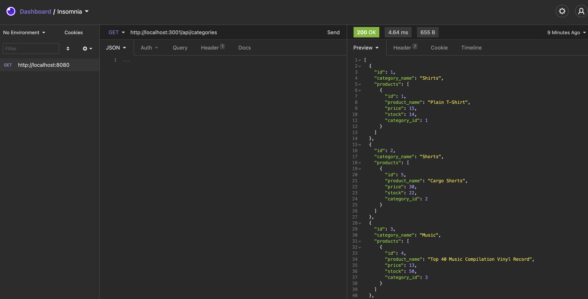
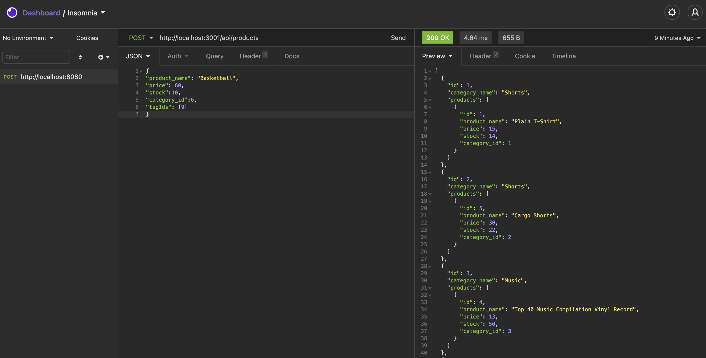

# ecommerce back end

  

  ## Description
  The server side of an ecommerce site. Make POST, PUT, GET and DELETE requests to a database from the CLI.

  ## Table of Contents
  - [Installation](#installation)
  - [Usage](#usage)
  - [Screenshot](#screenshot)
  - [How to contribute](#contribute)
  - [Demo video](#video)
  - [License](#license)
  - [Questions](#questions)

  ## Installation
  run npm i and setup a db using the schema.sql and seeding it with the data provided.

  ## Usage
  npm start

  ## Screenshot
  
  

  ## Contribute
  Email me on watts.e.michelle@gmail.com

  ## Video
[Watch a demo video of the application](https://drive.google.com/file/d/1b_Lz-J0o321nnhtw6Pv4SpTMkLPLo9PT/view?usp=sharing)

  ## License

Permission is hereby granted, free of charge, to any person obtaining a copy of this software and associated documentation files, to deal in the Software without restriction, including without limitation the rights to use, copy, modify, merge, publish, distribute, sublicense, and/or sell copies of the Software.

  ## Questions
  [Github: michellewatts20000](https://github.com/michellewatts20000)
   
  [Email: watts.e.michelle@gmail.com](mailto:watts.e.michelle@gmail.com)
